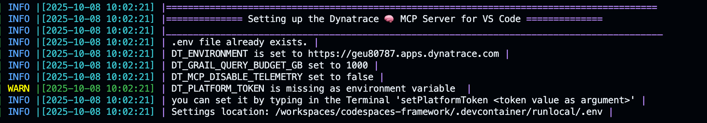
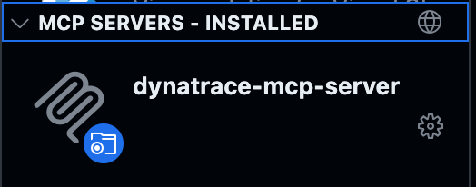
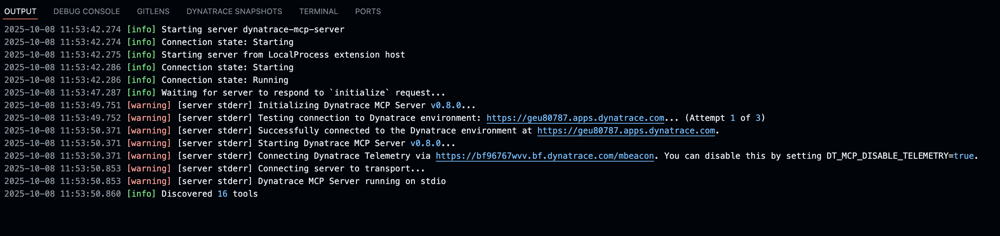
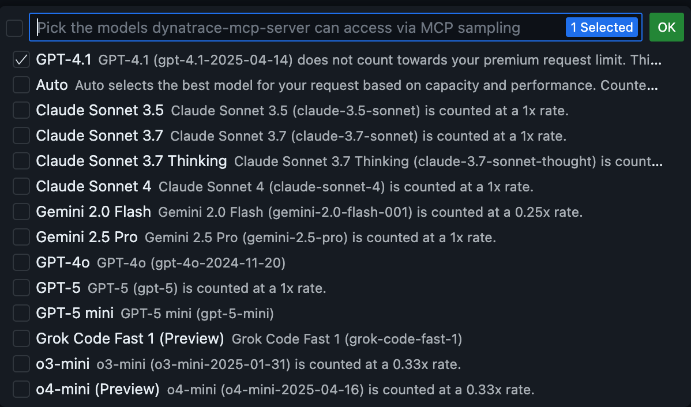

--8<-- "snippets/dynatrace-integration.js"

!!! info "Dynatrace MCP integration & Observability"
    This section explains how the [Dynatrace MCP Server](#dynatrace-mcp-server-integration) operates within your environment and how [Dynatrace Observability](#dynatrace-observability) is activated to monitor any application running in the enablement repositories.

---

##  MCP Server Integration
The Dynatrace MCP (Model Context Protocol) Server enables AI Assistants to seamlessly interact with the Dynatrace observability platform, delivering real-time data directly into your enablement workflows—no manual configuration required. It is automatically embedded in all repositories within the Framework for VS Code, ensuring consistent access to monitoring and automation capabilities across development environments.


### Prerequisites
1. The repository is opened in VS Code (Web and Desktop versions).
- You have defined the `DT_ENVIRONMENT` and `DT_PLATFORM_TOKEN` environment variables. 

??? info "Authentication scopes for DT_PLATFORM_TOKEN "
    For a full list of [supported scopes](https://github.com/dynatrace-oss/dynatrace-mcp?tab=readme-ov-file#scopes-for-authentication) and their use cases, refer to the Dynatrace MCP documentation.
    Once these variables are configured, your repository is ready to leverage Dynatrace’s observability and automation capabilities.


#### Verifying Prerequisites

To verify that the Dynatrace MCP Server has the environment variables needed in your codespace, type in the Terminal `setupMCPServer`
You should be able to see the settings and the variables.

{ width="800";}

If the `DT_PLATFORM_TOKEN` is missing, then easily add it by typing:

```bash

setPlatformToken <dt0s16.YOURTOKEN.XXXX>
```


### Starting the MCP Server  {align="right", width="200";}

On VS Code, on the left pane, click on the Extensions tab `Shift + ⌘ + X`. You should be able at the bottom to see a `dynatrace-mcp-server` installed under MCP servers.
    
1. Click on the wheel icon (settings) and click on Start Server
- The output should show automatically (if not then click on `show output`). You should be able to see a similar output:
    { width="800";}


!!! example ""
    Yay! the AI Agent (by default in VS Code is GPT) should be able now to fetch information from the Dynatrace environment.

### Example Prompts 

!!! example "Example Prompts 💬"
    
    | Use Case    | Prompt |
    | -------- | ------- |
    | Find a monitored entity  | `Get all details of the entity 'my-service'`    |
    | Find error logs |  `Show me error logs`     |
    | Write a DQL query from natural language    | `Show me error rates for the payment service in the last hour`    |
    | Explain a DQL query |  What does this DQL do? <br> `fetch logs | filter dt.source_entity == 'SERVICE-123' | summarize count(), by:{severity} | sort count() desc` |
    | Chat with Davis CoPilot | `How can I investigate slow database queries in Dynatrace?` |
    | Send email notifications |`Send an email notification about the incident to the responsible team at team@example.com with CC to manager@example.com`|
    |Multi-phase incident response | Our checkout service is experiencing high error rates. Start a systematic 4-phase incident investigation <br>1. Detect and triage the active problems <br>2. Assess user impact and affected services. <br>3. Perform cross-data source analysis (problems → spans → logs) <br>4. Identify root cause with file/line-level precision |

    For more prompts [read the full documentation](https://github.com/dynatrace-oss/dynatrace-mcp?tab=readme-ov-file#-example-prompts-)

### Configure Model Access
If you want to give access to other AI Agents and premium models, click in the Settings of the Dynatrace MCP Server, and select `Configure Model Access`, then select the models you want to give access to. 


{ align="center"; width="600";}


---


##  Dynatrace Observability
All repositories using the Enablement Framework can automatically activate Dynatrace Full-Stack Observability or Application Monitoring, enabling seamless monitoring of the Kubernetes cluster and all deployed applications—no manual setup required.

### Prerequisites
1. The following environment variables are set `DT_ENVIRONMENT` `DT_OPERATOR_TOKEN` `DT_INGEST_TOKEN`. These 3 variables are needed for monitoring the Kubernetes Cluster.

### Monitoring a Kubernetes Cluster automatically

Let's say we want to create an enablement where we deploy a Kubernetes Cluster and we want to deploy and monitor Astroshop also automatically when the enablement starts. Our post-create.sh file can look like this:

```bash title=".devcontainer/post-create.sh" linenums="1"
#!/bin/bash
#loading functions to script
export SECONDS=0
source .devcontainer/util/source_framework.sh

setUpTerminal

startKindCluster

installK9s

# Dynatrace Operator is deployed automatically
dynatraceDeployOperator

# You can deploy CNFS or AppOnly
deployCloudNative
#deployApplicationMonitoring

# The Astroshop will be deployed as a sample
deployApp astroshop

# This step is needed, do not remove it
# it'll verify if there are error in the logs and will show them in the greeting as well a monitoring 
finalizePostCreation

printInfoSection "Your dev container finished creating"
```


Now let's break it down.

1. Line 1 - 6: This code is needed for loading the framework and setting up the terminal for the container.
- Line 8 and 10: `startKindCluster` and `installK9s` creates the Kubernetes Cluster and installs k9s for easy management of your Kubernetes Cluster. For learning more go to [Kubernetes Cluster](framework.md#kubernetes-cluster) section of the Framework section.
- Line 13: `dynatraceDeployOperator` checks for the needed credentials and deploys teh Dynatrace Operator with its´'s components (CSI Driver and Webhook)
- Line 16: `deployCloudNative` deploys CloudNativeFullstack for Kubernetes. 
- Line 20: `deployApp astroshop` will call the deployApp repository and deploy Astroshop.

!!! info "Race conditions safeguard"
    The framework includes logic to manage resources efficiently and prevent race conditions. For example, deployCloudNative will not start while the Dynatrace Operator is being created. Once the Operator is ready, the CloudNative Full-Stack resources are deployed, followed by the application itself. This ensures that Dynatrace components are fully operational before any application deployment begins.


### Undeploying Dynakube

Now, let's say you want to undeploy the Dynakubes, there is a comfort function for you to do so, just type `undeployDynakube` and this will undeploy the Dynakubes. For changing the monitoring mode to `ApplicationMonitoring` just type `deployApplicationMonitoring` and this will deploy the Application Monitoring mode in the cluster.


<div class="grid cards" markdown>
- [Let's continue:octicons-arrow-right-24:](template.md)
</div>