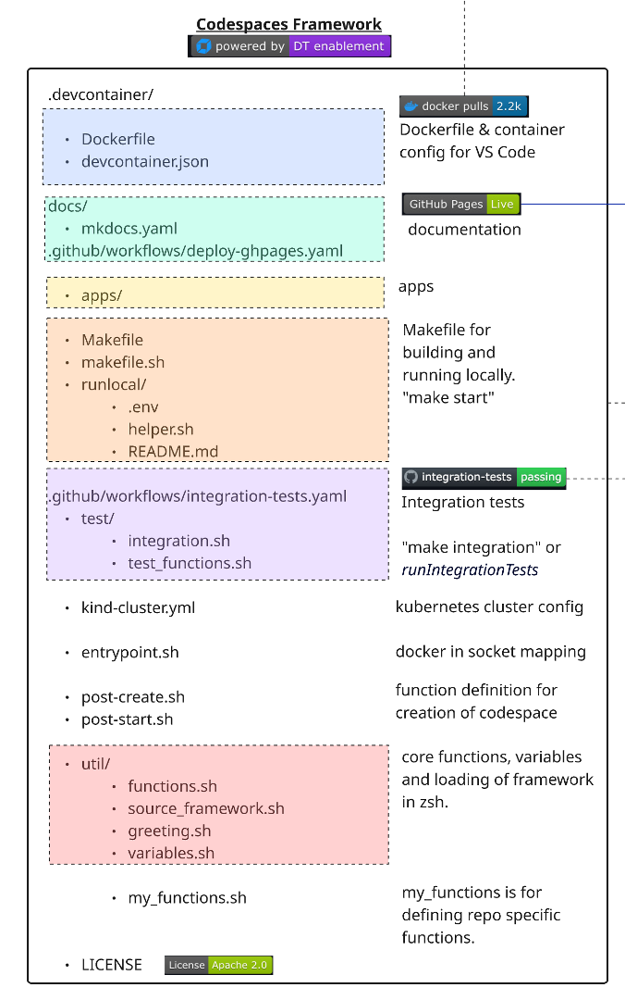
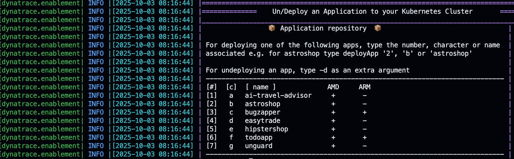

--8<-- "snippets/framework.js"


{ align=right ; width="400";}
This section outlines the structure and purpose of each component in the Codespaces Enablement Framework, as visualized in the architecture diagram.


---


## 🟦 Container Configuration for VS Code

Defines the development container for VS Code and Codespaces. Extensions are kept minimal to ensure portability across platforms (ARM and AMD), allowing the environment to run in plain Docker or on different architectures.

- **Dockerfile**: Specifies the base image and all required tools/libraries.
- **devcontainer.json**: Main configuration file for the development container. It defines settings, installed extensions, mounted volumes, arguments, environment variables, and how VS Code should start and connect to the container.

---


## 🟩 Documentation Workflow (`docs/`)

- **docs/**: Contains all documentation and site configuration.
- **mkdocs.yaml**: Defines navigation and site structure for MkDocs.
- **.github/workflows/deploy-ghpages.yaml**: GitHub Actions workflow to deploy documentation to GitHub Pages when a PR is merged into main.

### Live Documentation

- **installMkdocs**: Installs all requirements for MkDocs (including Python dependencies from `docs/requirements/requirements-mkdocs.txt`) and exposes the documentation locally. This is the recommended way to set up the documentation server in your dev container.
- **exposeMkdocs**: Launches the MkDocs development server on port 8000 inside your dev container, making the documentation available for live preview with live reload. This function is called by **installMkdocs**.

### Deploying to GitHub Pages

- **deployGhdocs**: Builds and deploys the documentation to GitHub Pages using `mkdocs gh-deploy`, publishing your latest docs to the configured GitHub Pages site.

---


## 🟨 App Repository (`apps/`)

This directory contains the application code and sample apps to be included in the enablement. Each app should have its own subfolder inside `apps/`.

### Port Allocation and NodePort Strategy


When deploying applications, the framework automatically allocates the ports exposed by the Kind Kubernetes cluster using the NodePort strategy. The `getNextFreeAppPort` function is called before deploying each app to select an available port from the defined range. By default, three ports are used, as defined in the `PORTS` variable in `.devcontainer/util/variables.sh`:

```bash
PORTS=("30100" "30200" "30300")
```


These ports are mapped to your applications, making them accessible from your host machine. The NodePort strategy ensures each app can be reached via a unique port on the cluster node.

### Managing Apps with `deployApps`


The framework provides a `deployApps` function to help you deploy and undeploy the applications listed in the `apps/` directory to your Kubernetes cluster.

Running `deployApps` without parameters displays an interactive help menu listing all available apps, their aliases, and their compatibility (AMD/ARM). Example output:

{ align=center ; } 

#### To deploy an app
- Use any of the listed numbers, characters, or names. For example, to deploy `astroshop`, you can run:
	```sh
	deployApps 2
	# or
	deployApps b
	# or
	deployApps astroshop
	```

#### To undeploy an app
- Add `-d` as an extra argument:
	```sh
	deployApps 2 -d
	# or
	deployApps astroshop -d 
	```


Each app folder should contain its own deployment and cleanup scripts or instructions. The `deployApps` function will call these as needed.

---


## 🟧 Running Locally

To quickly start a local development container, run:

```sh
cd .devcontainer
make start
```


Scripts and configuration for building and running the environment outside Codespaces include:

- **Makefile**: Main entrypoint for local development (`make start`). It defines targets for starting, stopping, and managing the local container environment.
- **makefile.sh**: Contains the core Bash logic for building, running, and managing the container. The Makefile sources this script to execute its targets. Key responsibilities include:

	- Building the Docker image if it does not exist
	- Starting the container with the correct environment, ports, and volumes
	- Attaching to a running container or recreating it if stopped
	- Handling cleanup and removal of containers/images
	- Providing utility functions for logs, shell access, and status checks

	This separation allows you to keep complex logic in Bash, while the Makefile provides a simple interface for users.

- **runlocal/**: Local environment configuration, including:

	- `.env`: Secrets and environment variables for local runs.
	- `helper.sh`: Helper scripts for local setup.

---


## 🟪 GitHub Actions & Integration Tests

Automation for CI/CD and integration testing:
- **.github/workflows/integration-tests.yaml**: Workflow for running integration tests on every Pull Request (PR) and push. The `main` branch is protected: integration tests must pass for any PR before it can be merged into `main`.
- **test/**: Contains test scripts:
	- `integration.sh`: Main integration test runner.
	- `test_functions.sh`: Test utilities and functions.


### Integration Test Function

- **runIntegrationTests**: This function triggers the integration tests for the repository by running the `integration.sh` script. It is used both locally and by the CI pipeline to ensure the environment and applications work as expected before merging changes.

```bash title="integration.sh" linenums="1"
#!/bin/bash
# Load framework
source .devcontainer/util/source_framework.sh

printInfoSection "Running integration Tests for $RepositoryName"

assertRunningPod dynatrace operator

assertRunningPod dynatrace activegate

assertRunningPod dynatrace oneagent

assertRunningPod todoapp todoapp

assertRunningApp 30100
```


These assertions check that the required pods (operator, activegate, oneagent, and todoapp) are running in their respective namespaces, and that the application is accessible on the expected port (30100). If any assertion fails, the integration test will fail and block the PR from being merged.

---


## 🟫 Kubernetes Cluster

The Kubernetes cluster for the enablement is defined in the `kind-cluster.yaml` file. This configuration is used by [Kind](https://kind.sigs.k8s.io/) (Kubernetes IN Docker) to spin up a local Kubernetes cluster as a Docker container, using the Docker-in-socket strategy. The enablement container attaches to the Kind cluster, allowing you to deploy and test applications in a real Kubernetes environment.

### Managing the Kind Cluster

The following functions are provided to manage the lifecycle of the Kind cluster:

- **startKindCluster**: Starts the Kind cluster. If a cluster is already running, it attaches to it; if stopped, it starts it; if none exists, it creates a new one.
- **attachKindCluster**: Attaches your environment to a running Kind cluster by configuring your kubeconfig for access.
- **createKindCluster**: Creates a new Kind cluster using the configuration in `kind-cluster.yaml`.
- **stopKindCluster**: Stops the Kind cluster Docker container.
- **deleteKindCluster**: Deletes the Kind cluster and removes all associated resources.

These functions allow you to easily start, stop, attach, create, or delete your local Kubernetes cluster for development and testing.


The `kubectl` client, `helm`, and `k9s` are automatically configured to work with the Kind cluster, so you can manage and observe your Kubernetes resources out of the box.


---


## 🐳 Docker Socket Mapping (`entrypoint.sh`)

This section enables the container to access the host's Docker daemon by mounting the Docker socket (`/var/run/docker.sock`). This allows the container to start and manage sibling containers, which is essential for running Kind and other Docker-based tools inside the dev environment.

**entrypoint.sh**: This script is executed when the container starts. It sets up the environment, ensures the Docker socket is available, and configures any required permissions or environment variables so that Docker commands work seamlessly inside the container.


---


## 🟦 Container Post-Creation & Start (`post-create.sh`, `post-start.sh`)

!!! tip "Repository-Specific Logic"
	Use these files to define logic for automating the creation and setup of your enablement.

These scripts automate the setup and initialization of your development container:

- **post-create.sh**: Runs after the Codespace or dev container is created. It loads all framework and custom functions into the shell, then executes a series of setup steps in order:

	Example `post-create.sh`:
	```bash title=".devcontainer/post-create.sh" linenums="1"
	#!/bin/bash
	# Load functions
	export SECONDS=0
	source .devcontainer/util/source_framework.sh

	setUpTerminal

	startKindCluster
	
	installK9s
	
	dynatraceDeployOperator
	
	deployCloudNative
	
	deployTodoApp
	
	finalizePostCreation
	
	printInfoSection "Your dev container finished creating"
	```

- **post-start.sh**: Runs every time the container starts (e.g., refresh tokens, check dependencies, interact with the user).


---


## 🟥 Core Functions (`util/`)

This directory contains reusable shell functions, variables, and logic that power the framework. These scripts are loaded into every shell session, making their utilities available for all automation and interactive tasks.

- **functions.sh**: Main library of core functions for the framework. Includes:
	- Logging and info utilities (`printInfo`, `printWarn`, `printError`, `printInfoSection`)
	- Kubernetes helpers (e.g., `waitForPod`, `waitForAllPods`, `waitForAllReadyPods`)
	- Application deployment, integration, and environment management functions
	- Functions for tracking codespace creation, printing greetings, and more
	- All functions are loaded dynamically for use in the shell or scripts
- **source_framework.sh**: Loads the framework and all utility scripts into the shell, ensuring both core and custom functions are available in every environment (Codespaces, VS Code, or plain Docker).
- **greeting.sh**: Displays a welcome message and branding when a new shell session starts, including useful environment info and quickstart tips. Print the greeting at any time by calling the `printGreeting` function or by opening a new zsh terminal.
- **variables.sh**: Central place for defining and exporting all default variables, such as image versions, port ranges, and environment-specific settings. This ensures consistency and easy configuration across the framework.

---


## 🟫 Custom Functions

- **my_functions.sh**: Define repository-specific or custom functions here. This file is loaded after the core framework, allowing you to override or extend any behavior. For example, add a function to deploy your own app and call it from `post-create.sh`.

---


## 📄 License

This project is licensed under the Apache 2.0 License.

---

<div class="grid cards" markdown>
- [Let's continue:octicons-arrow-right-24:](user-experience.md)
</div>