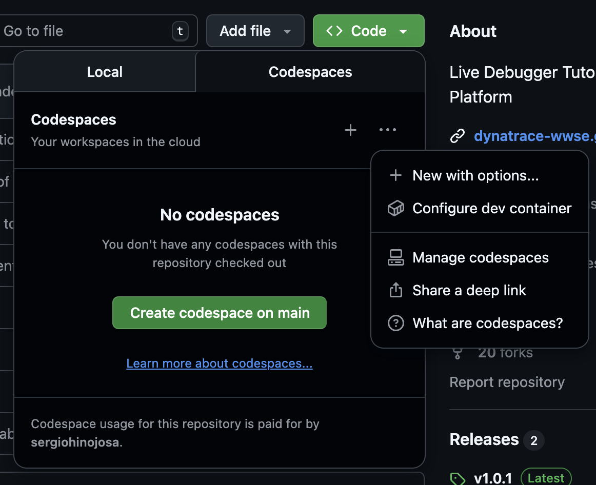

--8<-- "snippets/instantiation-types.js"

!!! success "Choose the option that best fits your needs! 🚀" 
    The Dynatrace Enablement Framework supports multiple ways to instantiate your development environment, making it flexible for any workflow or platform.  


## 🏃🏻‍♂️ How to run in...

### ☁️ GitHub Codespaces
- { align=right ; width="250"}  In the repository hosted in github, click on the **<> Code** button. Create a new codespace using the main branch or click + New with options to customize how and where to run the Codespace within Github Cloud. 
- Secrets (`DT_TENANT`, `DT_OPERATOR_TOKEN`, `DT_INGEST_TOKEN`) are injected automatically using GitHub Codespaces secrets.
- No manual setup required—these are available as environment variables inside the container.


!!! tip "Protip: Run in any ☁️ cloud provider of your choice"
     For **VS Code Dev Containers** and **Local Container** you'll need to provide the infrastructure. You can run the enablements in any cloud provider of your choice. For best compatibility we recommend you to spin a VM with an Ubuntu Operating System. Then do a remote connection via VS Code for instantiating VS Code Dev Container or via SSH to run as a Local Container. 

### 🖥️ VS Code Dev Containers
- Clone the repository to your local machine (Ubuntu OS recommended for best compatibility).
- Add a .env file and and adapt the `devcontainer.json` to read the secrets from the environment and not from the secrets section.
- In this framework, secrets are passed as environment variables using `runArgs` in `.devcontainer/devcontainer.json`:
	```json
	"runArgs": ["--init", "--privileged", "--network=host", "--env-file", ".devcontainer/runlocal/.env"]
	```
- This ensures all variables in `.devcontainer/runlocal/.env` are available inside the container.
- { align=right ; width="400"}Open the folder in VS Code and use the Dev Containers extension to "Reopen in Container". VS Code will use the `.devcontainer/devcontainer.json` definition to build and start the environment for you.
- You can rebuild the container at any time by typing ```[CTRL] + Shift P > Dev Containers: Rebuild and reopen in container```

### 🐳 Local Container
- Clone the repository to your local machine (Ubuntu OS recommended for best compatibility).
- Open a terminal in the `.devcontainer` folder and run:
	```sh
	make start
	```
- This will build and launch the container, or attach to it if already running. All ports, volumes, and environment variables are set up automatically.
- Secrets and environment variables are loaded from `.devcontainer/runlocal/.env`. 
- The devcontainer.json file is not used with this set-up. Arguments, volume mounts, port-forwarding is handled in the `makefile.sh`
- The `makefile.sh` script passes the variables to Docker at runtime.
- For more details, see the [Local Container Details](#local-container-details) section below.


## Instantiation Types 
### ☁️ GitHub Codespaces

- **One-click cloud dev environments**  
- No local setup required—just click  
- [Learn more about Codespaces](https://github.com/features/codespaces)

[](https://github.com/codespaces/new?template_repository=dynatrace-wwse/codespaces-framework)

### 🖥️ VS Code Dev Containers

- Use the [Dev Containers extension](https://marketplace.visualstudio.com/items?itemName=ms-vscode-remote.remote-containers) for a seamless local experience in VS Code
- All configuration is in `.devcontainer/devcontainer.json`
- Supports secrets, port forwarding, and post-create hooks


### 🐳 Local Container

- Run the same environment on your machine using Docker.
- Easiest way: just run `make start` in the `.devcontainer` folder.
- This will build and launch the container if needed, or attach to it if already running.
- All ports, volumes, and environment variables are set up for you automatically.

See [Local Container Details](#local-container-details) below for a full explanation of how this works.


## ⚡ Quick Comparison

| Type                  | Runs On              | VS Code Needed | Fast Start | Customizable | Secrets Handling | Port Forwarding | Best For                  |
|-----------------------|:--------------------:|:--------------:|:----------:|:------------:|:---------------:|:---------------:|---------------------------|
| ☁️ Codespaces         | GitHub Cloud         | ❌             | ✅         | ❌           | Auto-injected   | Auto            | Quick onboarding, demos   |
| 🖥️ VS Code DevContainer | Provided Infrastructure | ✅             | ✅         | ✅           | Auto/manual     | Auto            | Full-featured local dev   |
| 🐳 Local Container    | Provided Infrastructure | ❌             | ✅         | ✅           | Manual/`.env`   | Manual/Makefile | Reproducible local dev    |


## 🔐 Secrets & Environment

Secrets and environment variables are handled differently depending on the instantiation type:

| Instantiation Type         | How Secrets Are Provided                                                                 | Where to Configure/Set                        | Notes                                                                                 |
|---------------------------|----------------------------------------------------------------------------------------|-----------------------------------------------|---------------------------------------------------------------------------------------|
| ☁️ Codespaces             | Auto-injected as environment variables from GitHub Codespaces secrets                   | GitHub repository > Codespaces secrets         | No manual setup; secrets available at container start                                 |
| 🖥️ VS Code Dev Containers | Passed as environment variables via `runArgs` and `.env` file                          | `.devcontainer/devcontainer.json`, `.devcontainer/runlocal/.env`      | Edit/add `.devcontainer/runlocal/.env` for local secrets; `runArgs` must include `--env-file`                    |
| 🐳 Local Container        | Loaded from `.devcontainer/runlocal/.env` file and passed to Docker at runtime by `makefile.sh`                | `.devcontainer/runlocal/.env`, `makefile.sh`   | Run `make start` in `.devcontainer`; secrets loaded at container start                |


### Example: `runlocal/.env` file

```env
# Environment variables

# Mapping of the Secrets defined in the .devcontainer.json file
# Dynatrace Tenant
DT_TENANT=https://abc123.live.dynatrace.com
#Description: eg. abc123 for live -> https://abc123.live.dynatrace.com or sprint -> https://abc123.sprint.dynatracelabs.com no apps in the URL

# Dynatrace Operator Token
DT_OPERATOR_TOKEN=dt0c01.XXXXXX
#it will be created automatically when adding a new Cluster over the UI. It contains the following permissions: 'Create ActiveGate tokens' 'Read entities' 'Read settings' 'Write settings' 'Access probrem and event feed, metrics and topology' 'PaaS Integration - installer download

#Dynatrace Ingest Token
DT_INGEST_TOKEN=dt0c01.YYYYYY
# it will be created automatically when adding a new Cluster over the UI. It contains the following permissions: 'Ingest logs' 'Ingest metrics' 'Ingest OpenTelemetry traces'

# Add any other environment variables as needed
```


---

## Running locally

### Using Multipass for Local Development

[Multipass](https://multipass.run/) is a lightweight VM manager from Canonical that makes it easy to launch and manage Ubuntu virtual machines on macOS, Windows, and Linux. This is especially useful if you want to run the framework in a clean, reproducible Ubuntu environment without dual-booting or using a full desktop VM.

**Why use Multipass?**

- Ensures compatibility with Ubuntu-based dev containers and scripts
- Isolates your development environment from your host OS
- Quick to launch, easy to reset or remove

#### Basic usage

  -  **Install Multipass** ([instructions](https://multipass.run/install)) 
  -  **Launch an Ubuntu VM:**
	```sh
	multipass launch --name dt-dev --disk 20G --mem 4G
	multipass shell dt-dev
	```

#### Set up your environment
	- Inside the VM, install Docker and git:
	  ```sh
	  sudo apt update && sudo apt install -y docker.io git
	  sudo usermod -aG docker $USER
	  ```
	- Clone your repository and proceed with the [Local Container](#local-container) or [VS Code Dev Containers](#vs-code-dev-containers) setup as described above.

!!! tip "Mounting Volumes on Multipass"
    You can mount folders from your host into the VM using `multipass mount` if you want to edit code locally but run containers in the VM. For example in the following example we are creating a VM mounting the folder `enablement` where you have all repositories of the enablement framework you want to use. 
    ```bash
    multipass launch --name enablement --disk 30G --cpus 8 --memory 32G --mount  /Users/sergio.hinojosa/repos/enablement:/home/ubuntu/enablement
    ```

## Local Container Details

The `make start` command is the recommended way to launch your local development container. Here’s what happens under the hood:

- The `Makefile` defines a `start` target, which sources `makefile.sh` and calls the `start` function.
- The `start` function:
	- Checks if the container (`dt-enablement`) is running:
		- If running, attaches a new shell to it (like creating more Terminals on VS Code).
		- If stopped, removes and recreates the container.
		- If the image is missing, builds it and then runs the container.
	- All required ports, volumes, and environment variables are set up automatically.
	- The container is started with the correct working directory and post-create/start scripts, just like in Codespaces or Dev Containers.


<div class="grid cards" markdown>
- [Let's continue:octicons-arrow-right-24:](template.md)
</div>