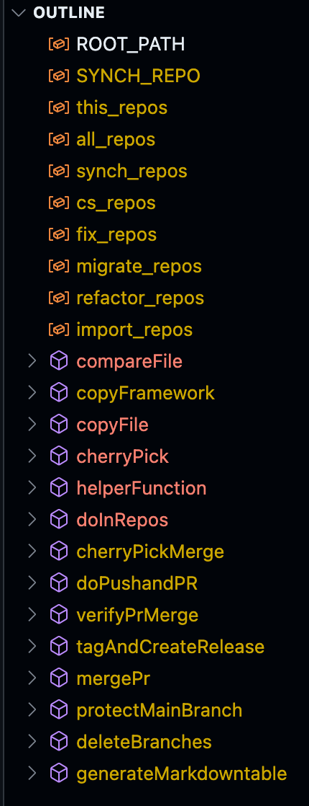

--8<-- "snippets/synchronizer.js"

# 7. Synchronizer

!!! example "Codespaces Synchronizer 🔁 " 
	Maintaining and updating multiple repositories can be complex and time-consuming. To address this, we developed the **codespaces-synchronizer**, a tool designed to keep all repositories using the framework up-to-date with minimal manual intervention.
	{ align=center ; width="800";} 

## Overview

The synchronizer operates from a host machine where all target repositories are cloned. It leverages bash scripting and `rsync` to automate repository management tasks, including updates, migrations, tagging, and branch protection. The synchronizer is composed of two main files:

- **`synch_functions.sh`**: Contains all core logic and reusable functions for repository operations.
- **`run.sh`**: Entry point script that loads the framework and orchestrates the synchronization process by invoking functions from `synch_functions.sh`.

## Key Use Cases

- **Update repositories**: Propagate framework or configuration changes across multiple repositories.
- **Migrate repositories**: Move or refactor repositories while preserving history and structure.
- **Create Tags, Versions, and Releases**: Automate versioning and release management.
- **Protect branches and test workflows**: Enforce branch protection rules and validate workflows.

---

## Requirements

{ align=right ; width="180";} 

- A host machine with all target repositories cloned locally.
- GitHub permissions to create branches and pull requests.
- Bash terminal access.
- `rsync` installed on the host.

## Strategies for Updating and Migrating Repos 

- **Cherry-pick**: Selectively apply commits from the synchronizer remote repository.
- **Rsync**: Efficiently synchronize files and directories between repositories (prefered approach).

## How It Works

1. **Initialization**: `run.sh` sets up environment variables and loads `synch_functions.sh`.
2. **Repository Selection**: The synchronizer can operate on all repositories or a specified subset.
3. **Function Execution**: Core functions (such as updating files, creating tags, or migrating content) are executed in batch across repositories.
4. **Automation**: Common git operations (checkout, pull, commit, push, PR creation, verify PR, merge PR) are automated, reducing manual effort and risk of errors.

---

- [Let's continue:octicons-arrow-right-24:](testing.md)

