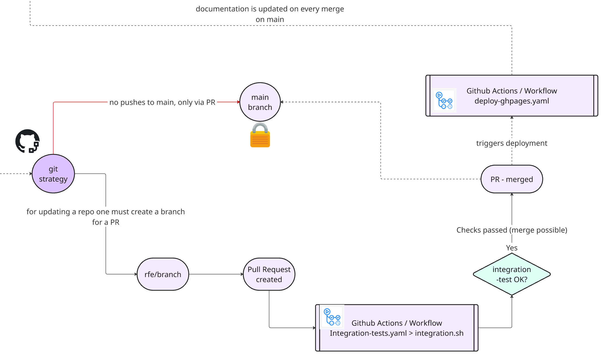

--8<-- "snippets/testing.js"


!!! example "Quality Assurance"
    To maintain high standards across all repositories using the enablement framework, a robust testing strategy is enforced. This ensures every repository remains reliable, consistent, and production-ready.

## 🧪 Integration Testing on Pull Requests

- **Automated Integration Tests:**  
  Every repository must include integration tests that run automatically on every Pull Request (PR). This ensures new changes do not break existing functionality.

- **integration.sh Script:**  
  The core of the testing process is the `integration.sh` script, located in the root of each repository. This script is adapted as needed and is triggered by a GitHub Actions workflow on every PR.
  - The workflow provisions a full Codespace environment, deploying all required applications and dependencies.
  - Once the environment is ready, `integration.sh` runs a series of assertions to verify that applications and pods are running as expected in their respective namespaces.

- **On-Demand Testing:**  
  Integration tests can also be executed manually at any time using the `runIntegrationTests` function, allowing developers to validate changes before submitting a PR.


### Example: integration.sh

```bash title="integration.sh" linenums="1"
#!/bin/bash
# Load framework
source .devcontainer/util/source_framework.sh

printInfoSection "Running integration tests for $RepositoryName"

assertRunningPod dynatrace operator

assertRunningPod dynatrace activegate

assertRunningPod dynatrace oneagent

assertRunningPod todoapp todoapp

assertRunningApp 30100

```

## Git Strategy

!!! example "Git Strategy & GitHub Actions Workflow"
    { align=center ; width="800";}

## 🔒 Branch Protection

**Main Branch Protection:**  
  The `main` branch is protected and will only accept PRs that pass all integration tests. This ensures only thoroughly tested code is merged, maintaining the integrity of the repository.

---


## 🛡️ Integration Test Badges

All repositories in the enablement framework display an **integration test badge** to show the current status of their automated tests. This badge provides immediate visibility into the health of each repository.

For example, the badge for this repository is:

{ align=center;  }

You can find a table with all enablement framework repositories and their current integration test status in the [README section of this repository](https://github.com/dynatrace-wwse/codespaces-framework).

---

By following these standards, the enablement framework enforces continuous quality assurance and reliability across all managed repositories.


<div class="grid cards" markdown>
- [Continue to Monitoring →](monitoring.md)
</div>